# 微信公众号

# 理论指导

## P1 创办公众号的目的

#### 1.创办公众号的目的

- 个人
  1. 情感、兴趣爱好
  2. 打造个人品牌
  3. 为店铺引流
  4. 面试、证明自己的能力

- 公司
  1. 企业文化的传播，品牌形象的树立
  2. 服务客户，留住老顾客

#### 2.课程内容

1. 理论指导（定位、名字、功能介绍）
2. 基本操作（注册、开通、后台操作、页面设置）
3. 工具技巧（编辑、排版、图片搜索、搭配、处理）
4. 引流方式


## P2 公众号定位

#### 1.专业、特长

#### 2.兴趣爱好

- 回想以前的经历
- 逛知乎、悟空回答找灵感
- 借鉴别人的公众号找灵感
- 查找资料，慢慢积累输出

#### 3.自身经历、体验

#### 4.未来工作

#### 5.其他（娱乐八卦、信息咨询、专注转载、分享）


## P3 公众号名字的几种类型

#### 1.名字的几种类型

1. 个人品牌（李教授、局座召忠）
2. 领域名称（十点读书、爱健身）
3. 个人品牌+领域名称（丁香医生、何凯文考研英语）
4. 公司名称（摩拜单车）
5. 其他（彪悍一只猫、学习学习再学习）

#### 2.起名字的注意事项

1. 名字不易太长（不正常人类研究中心）
2. 名字不要太复杂，尤其夹杂繁琐的英文（Ayawawa、Jessica穿衣打扮）
3. 避免使用生僻字、冷门、易混淆的词汇
   * 一直特立独行的猫——>一只特立独行的猫
   * 罗辑思维——>逻辑思维
   * 民法段波

#### 3.起名字的三个步骤

1. 明确公众号定位，特色
2. 列出你所能想到的关联词语
3. 关键词重组


## P4 功能介绍

1. 强调自己的专业、个人的身份、经验、能力，让用户对你产生信赖
2. 明确你的公众号定位，能给用户带来什么利益价值


## P5 注册前的准备工作

1. 提前起好公众号的名字，并做好测试

   ​	使用[搜狗搜索引擎](https://www.sogou.com/)，左上角选择“微信”，搜索是否有重名公众号。

2. 手持身份证照片（非必需项）
3. 邮箱（没有绑定微信下的任何一个产品）
4. 个人头像
5. 功能介绍


## P6 公众号的注册流程

1. 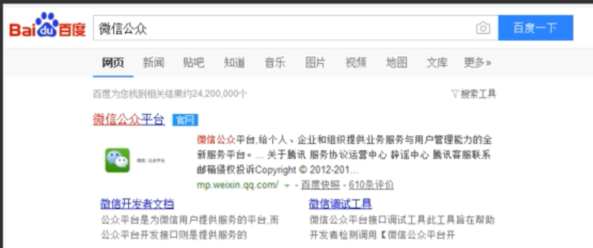
2. 
3. 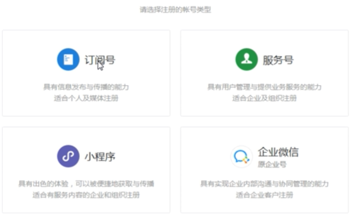
4. 填写基本信息，点击“注册”。
5. 选择订阅号，点击“下一步”。
6. 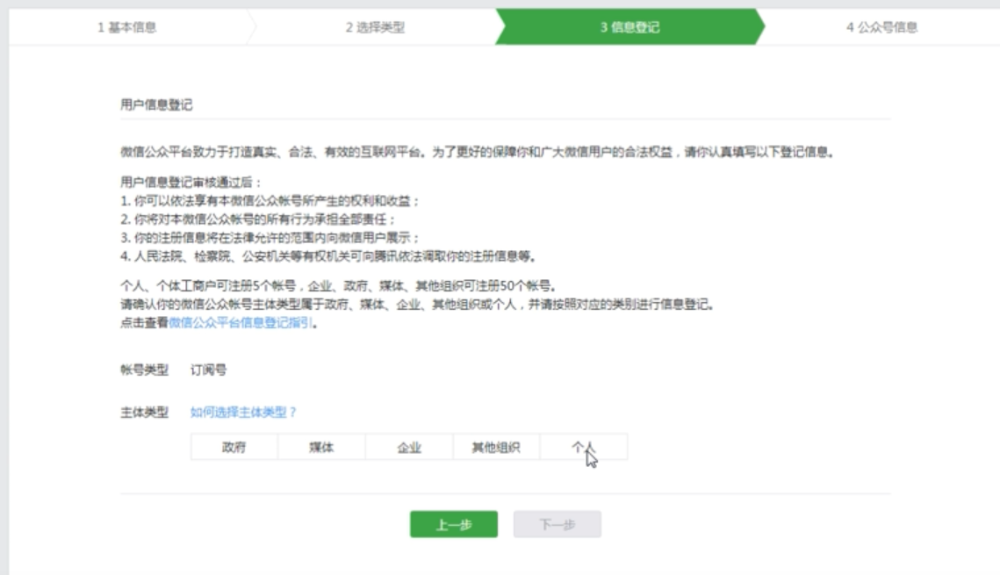
7. 身份验证
8. 填写公众号信息

注意：

​		如果因为没有准备好“公众号名称”及“功能介绍”的内容（第8步）而退出，在下次点击重新注册时会显示邮箱被占用，此时不需要重新注册，直接再登录页面输入账号密码，会自动跳转到上次注册的地方。


# 基本操作

## P7 公众号后台功能

#### 1.完善公众号信息

- 头像、微信号、二维码等
- 功能设置：图片水印可选择微信号或公众号

#### 2.自动回复

- 关键词回复
- 收到消息回复
- 被关注回复

#### 3.自定义菜单

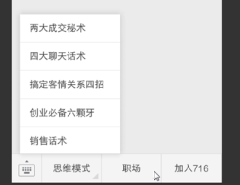

#### 4.添加功能插件

- 卡卷功能
- 微信小店等

#### 5.管理

- 消息管理
- 用户管理
- 素材管理

#### 6.推广

- 广告主：腾讯帮助公众号打广告，收费
- 流量主：帮助别人打广告，粉丝多了可以申请承接广告，并收取一定费用

#### 7.统计

- 用户分析
- 图文分析
- 菜单分析
- 消息分析
- 接口分析
- 网页分析


## P8 自动回复的设置

#### 1.被关注回复

- 文字
- 图片
- 语音
- 视频

#### 2.关键词回复

​		规则名称——>关键词（半匹配、全匹配）——>回复内容（可添加文字、图片等）——>回复方式（全部）

#### 3.收到消息回复


## P9 编辑发布图文消息

- 素材管理——>新建图文素材
- 标题、作者、正文
- 工具栏：引用、分割线、超链接等
- 勾选“原文链接”在手机上显示为“阅读原文”


## P10 设置自定义菜单

- 自定义菜单——>新建菜单
- 建议设置两个：
  - 历史文章：首先设置名称“历史文章”——>跳转网页——>从公众号图文消息中选择——>历史消息（勾选**跳转到历史消息列表**）——>确定即可
  - 主菜单（@我）——>点击加号，创建子菜单——>例如自我介绍、定位介绍等


## P11 文字跳转链接的设置

```markdown
<a href="在这里输入网址">在这里输入显示的文字</a>
```

只能使用在”**自动回复**“中

如果设置多个链接，最好一次性设置好，如果设置一个点一次保存，第一个链接可能会失效。


## P12 公众号的几种链接形式

#### 1.阅读原文衔接（可随意插入任意网址）

#### 2.文章链接

- 只能链接文章
- 而且时发布在公众号里的文章
- 可以是自己的也可以是别人的

#### 3.文字链接（只能在自动回复中使用）


## P13 公众号开通原创

#### 1.开通原创的好处

- 原创标签

  

- 开通赞赏

  

- 开通留言

  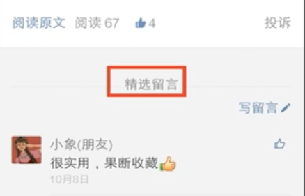

  

  开通页面模板

  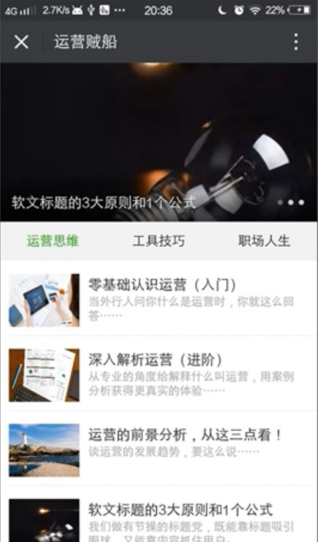

#### 2.开通原创的要求

- 文章的原创度
- 公众号的活跃度
- 文章发布的频率


## P14 页面模板的设置

点击**添加功能插件**，选择**页面模板**，选择**综合模板**

- 首先添加**封面文章**，最多只能三篇，

- 添加**分类名**，之后添加文章

  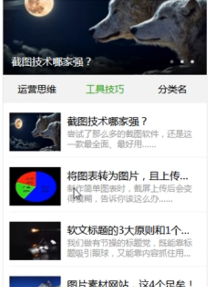

- 链接到自定义菜单，选择**跳转网页**，页面地址选择**页面模板**
- 页面模板可以创建15个


## P15 编辑排版注意事项

- 确定排版样式，形成自己的风格
- 简单原则，不要为了排版而排版，颜色不要超过三种
- 字号在14—16之间，标题保持在14个字以内，摘要在36个字以内，包括符号
- 段落无需空格，两边对齐，行间距设置在1.75—2，段与段之间之间空行
- 一定要多次预览，反复修改


# 工具技巧

## P16 编辑器介绍

- 135编辑器、秀米编辑器在线编辑工具
- 新媒体管家、壹伴编辑排版插件


## P17 135编辑器的使用

复制粘贴/直接导入文档（收费）

- 首先清除格式，修改字号，行间距

  

- 左边选择标题、正文、引导、图文、布局的样式

  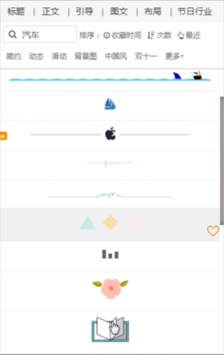

- 保存文章可以网站关联公众号，直接保存到公众号素材库。或全选复制粘贴。
- 有模板，可选择模板之后自己替换其中文字


## P18 秀米编辑器的使用

- 全选，修改字号、字体、颜色、行间距等

  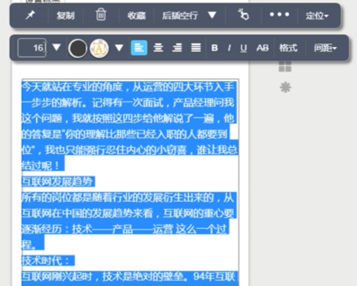

- 多种模板，选择

  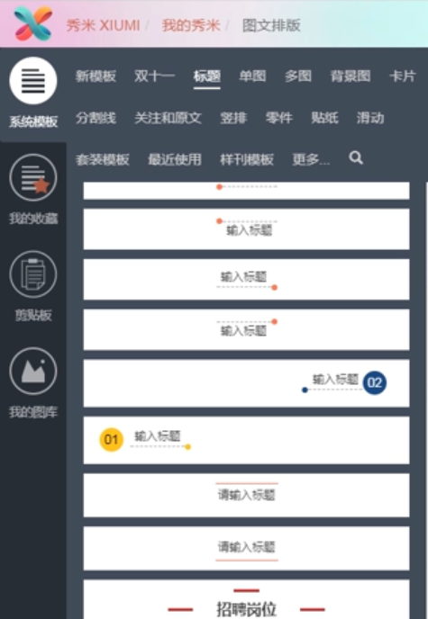

- 保存、预览、同步到公众号

  

  

## P19 新媒体管家和壹伴编辑插件

#### 1.新媒体管家

​	

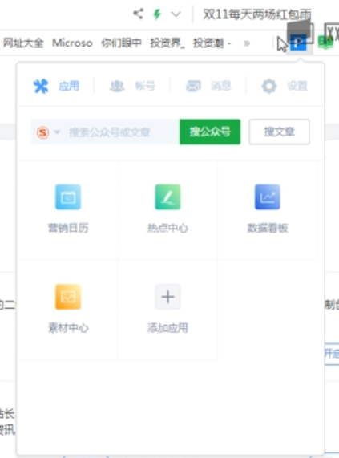

#### 2.壹伴插件

​	两款插件类似，仅有一点差别。

#### 下载地址：

- [新媒体管家](https://xmt.cn/index)
- [壹伴](https://yiban.io/)


## P20 图片素材的搜集

#### 图片素材

- 高清，1M以上
- 免费

#### 网站

- [PEXELS](https://www.pexels.com/)
  - 推荐，国外网站，图片高清，并且可根据关键词，颜色，主题等进行搜索图片
- [Unsplash](https://unsplash.com/)
  - 国外网站，与PEXELS类似
- [拍信PAIXIN](http://www.paixin.com/)
  - 国内网站，免费素材变少，大部分收费
- [全景](http://www.quanjing.com/)
  - 素材较多，但图片较小，大约都是0.5M左右


## P21 动态图片

#### 网站

- [小猪动图](http://www.piggif.com/)
  - 好像网站已经没了，，，，，
- [SOOGIF](http://www.soogif.com/)
  - 可以链接135编辑器，

#### 功能

- 动图搜索
- 动图编辑（压缩，裁剪，水印）
- 动图制作


## P22 截图软件

- #### FSCapture

  - 现在好像要收费了，不再是免费得了

- 谷歌插件：nimbus

  - 来自弹幕推荐，


## P23 如何去除图片水印

- Inpaint
  - 效果好，非常方便，但是好像也开始收费了，，，，
- Photoshop
  - 专业，方便，本人也在用，，，


## P24 二维码的制作

- 1.修改编辑二维码

- 2.将一个二维码作为一个链接

  ​	（文章，个人微信，公众号，网址）

网站：	[草料二维码](https://cli.im/)

​	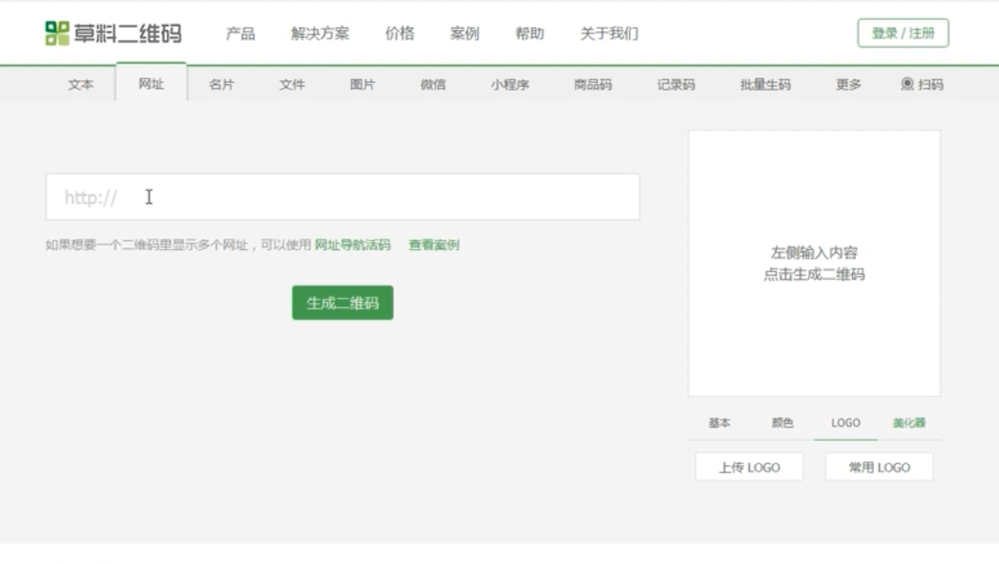


## P25 调查表单的使用

- [麦客表单](http://www.mikecrm.com/)
  - 调查问卷，用户人群，信息等
  - 参加活动报名等，


## P26 短网址

- [新浪短网址](http://sina.lt/)
- [百度短网址](http://dwz.cn/)


## P27 公众号分析助手

- [微小宝](https://www.wxb.com/)

  - 公众号分析平台

  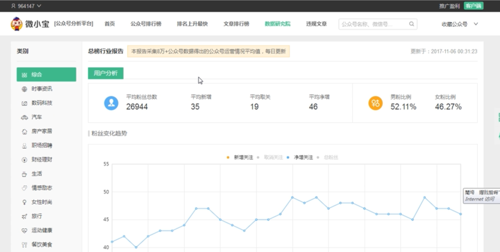

  - 有PC端，还有APP，


# 引流方式

## P28 免费引流方式

#### 回答问题引流

- 选择在哪里回答问题
  - 知乎（专业性强，信任度高，永久引流）
  - 悟空问答（浏览量大，精准推送，短期引流）
- 回答什么样的问题
  - 跟公众号定位相关的
  - 回答数和点赞数不能太多
  - 浏览数和关注数尽量够多
- 怎么回答问题
  - 自己擅长的
  - 自己不擅长的（盘点型文章）
  - 自身经历
  - 提供福利，资源


## P29 另外几种引流方式

#### 构建社区生态圈

- 加群，与自己公众号内容相关的群，发言互动

  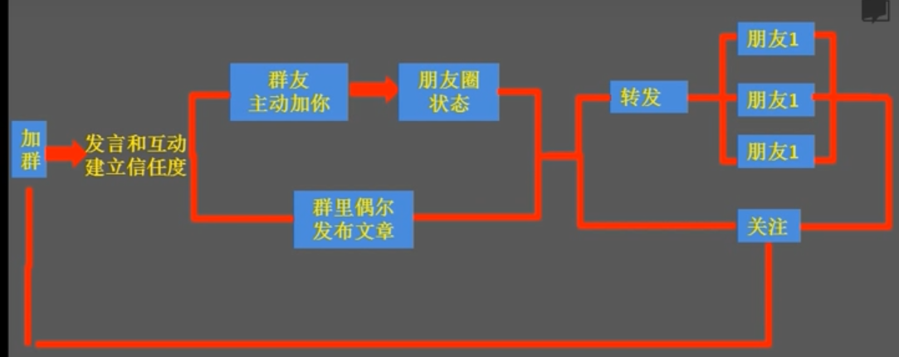

  

## P30 关于引流的

- 引流重点不在渠道多少
- 要有很强的执行力和足够的耐心
- 引流的效果需要不断地实践、反馈、总结


- 合作互推
- 各大平台内容推广
- 大号带小号
- 活动推广